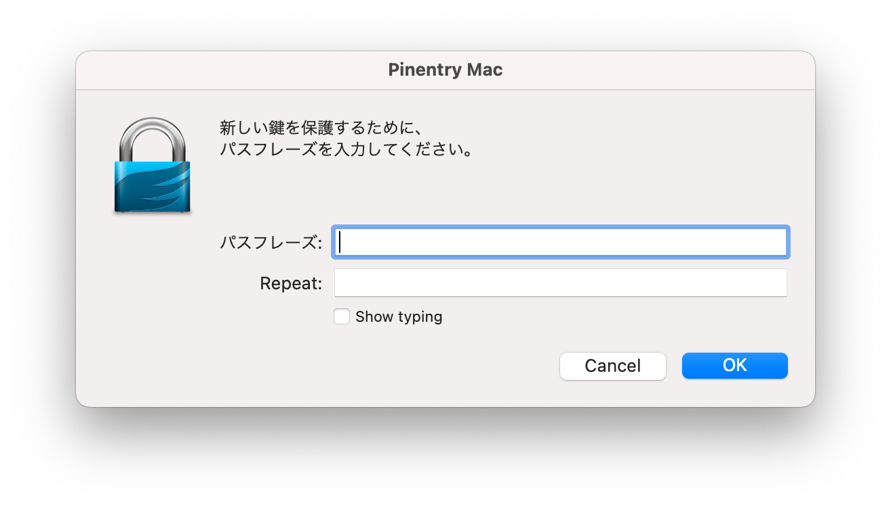

## GPGをMacにインストールした　Homebrewで

```
$ brew doctor
$ brew update
$ brew install pgp pinentry-mac
```

### ~/.gnupgディレクトリを作る

```
$ gpg --list-keys
gpg: keybox'/Users/kazurayam/.gnupg/pubring.kbx'が作成されました
gpg: /Users/kazurayam/.gnupg/trustdb.gpg: 信用データベースができました
```

```
$ tree ~/.gnupg
/Users/kazurayam/.gnupg
├── pubring.kbx
└── trustdb.gpg

0 directories, 3 files
:~
```

`~/.gnupg/pubring.kbx`ファイルが重要です。Gradleの`signing`プラグインを実行するとき `signing.secretKeyRingFile`というプロパティにこのファイルの絶対パスを指定してやることが求められます。


## GPGで秘密鍵と公開鍵のペアを生成する。

以下で個人情報を伏せ字にします。

```
$ cd gpgwork
:~/tmp/gpgwork
$ gpg --full-gen-key
gpg (GnuPG) 2.3.1; Copyright (C) 2021 Free Software Foundation, Inc.
This is free software: you are free to change and redistribute it.
There is NO WARRANTY, to the extent permitted by law.

ご希望の鍵の種類を選択してください:
   (1) RSA と RSA
   (2) DSA と Elgamal
   (3) DSA (署名のみ)
   (4) RSA (署名のみ)
   (9) ECC (署名と暗号化) *デフォルト
  (10) ECC (署名のみ)
  (14) カードに存在する鍵
あなたの選択は? 1
RSA 鍵は 1024 から 4096 ビットの長さで可能です。
鍵長は? (3072) 2048
要求された鍵長は2048ビット
鍵の有効期限を指定してください。
         0 = 鍵は無期限
      <n>  = 鍵は n 日間で期限切れ
      <n>w = 鍵は n 週間で期限切れ
      <n>m = 鍵は n か月間で期限切れ
      <n>y = 鍵は n 年間で期限切れ
鍵の有効期間は? (0)0
鍵は無期限です
これで正しいですか? (y/N) y

GnuPGはあなたの鍵を識別するためにユーザIDを構成する必要があります。

本名: **********
電子メール・アドレス: ###########@gmail.com
コメント: ???????????????
次のユーザIDを選択しました:
    "********* (???????????) <############@gmail.com>"

名前(N)、コメント(C)、電子メール(E)の変更、またはOK(O)か終了(Q)? o
たくさんのランダム・バイトの生成が必要です。キーボードを打つ、マウスを動か
す、ディスクにアクセスするなどの他の操作を素数生成の間に行うことで、乱数生
成器に十分なエントロピーを供給する機会を与えることができます。
たくさんのランダム・バイトの生成が必要です。キーボードを打つ、マウスを動か
す、ディスクにアクセスするなどの他の操作を素数生成の間に行うことで、乱数生
成器に十分なエントロピーを供給する機会を与えることができます。
```

ここでダイアログが表示された。



ここで生成された秘密鍵にたいしてパスワードを付与するから、指定せよ、と要求してくる。このパスワードは重要。忘れないようにメモしておくべし。Gradleの`signing`プラグインを実行するとき `signing.password`というプロパティにこのファイルのパスを指定してやることが求められる。

そして鍵の生成が行われた。

```
gpg: 鍵????????0634DE98を究極的に信用するよう記録しました
gpg: ディレクトリ'/Users/kazurayam/.gnupg/openpgp-revocs.d'が作成されました
gpg: 失効証明書を '/Users/kazurayam/.gnupg/openpgp-revocs.d/????????????????????????????????0634DE98.rev' に保管しました。
公開鍵と秘密鍵を作成し、署名しました。

pub   rsa2048 2021-08-01 [SC]
      ????????????????????????????????0634DE98
uid                      URAYAMA,kazuaki (My 1st Key generated by GPG) <kazuaki.urayama@gmail.com>
sub   rsa2048 2021-08-01 [E]

```

どんな公開鍵が生成されたか？

```
$ gpg --list-public-keys
gpg: *警告*: homedir '/Users/kazurayam/.gnupg'の安全でない許可
/Users/kazurayam/.gnupg/pubring.kbx
----------------------------------------
pub   rsa2048 2021-08-01 [SC]
      ????????????????????????????????0634DE98
uid           [  究極  ] URAYAMA,kazuaki (My 1st Key generated by GPG) <kazuaki.urayama@gmail.com>
sub   rsa2048 2021-08-01 [E]
```

どんな秘密鍵が生成されたか？

```
/Users/kazurayam/.gnupg/pubring.kbx
----------------------------------------
sec   rsa2048 2021-08-01 [SC]
      ????????????????????????????????0634DE98
uid           [  究極  ] URAYAMA,kazuaki (My 1st Key generated by GPG) <kazuaki.urayama@gmail.com>
ssb   rsa2048 2021-08-01 [E]

```

`????????????????????????????????0634DE98`という
40桁のコードがこんかい生成された鍵を表している。このコードが重要。
Gradleの`signing`プラグインを実行するとき `signing.keyId`というプロパティにこのファイルのパスを指定してやることが求められます。ただし40桁まるまる指定する必要はなくて末尾の8桁だけでよい。


https://stackoverflow.com/questions/27936119/gradle-uploadarchives-task-unable-to-read-secret-key

```
$ gpg --export-secret-keys -o secring.gpg
```

```
$ gpg --edit-key kazuaki.urayama@gmail.com
```


```
$ gpg --edit-key F389BF136A7C7EDE3BFA957A1C97BBC2E9F6C745
gpg (GnuPG) 2.3.1; Copyright (C) 2021 Free Software Foundation, Inc.
This is free software: you are free to change and redistribute it.
There is NO WARRANTY, to the extent permitted by law.

Secret key is available.

sec  rsa4096/1C97BBC2E9F6C745
     created: 2021-08-02  expires: 2023-08-02  usage: SC  
     trust: ultimate      validity: ultimate
ssb  rsa4096/1DA9E97C9BB61C7F
     created: 2021-08-02  expires: 2023-08-02  usage: E   
[ultimate] (1). URAYAMA,kazuaki (for OSSRH) <kazuaki.urayama@gmail.com>

gpg> addkey
Please select what kind of key you want:
   (3) DSA (sign only)
   (4) RSA (sign only)
   (5) Elgamal (encrypt only)
   (6) RSA (encrypt only)
  (10) ECC (sign only)
  (12) ECC (encrypt only)
  (14) Existing key from card
Your selection? 4
RSA keys may be between 1024 and 4096 bits long.
What keysize do you want? (3072) 4096
Requested keysize is 4096 bits
Please specify how long the key should be valid.
         0 = key does not expire
      <n>  = key expires in n days
      <n>w = key expires in n weeks
      <n>m = key expires in n months
      <n>y = key expires in n years
Key is valid for? (0) 2
Key expires at Wed Aug  4 21:07:45 2021 JST
Is this correct? (y/N) y
Really create? (y/N) y
We need to generate a lot of random bytes. It is a good idea to perform
some other action (type on the keyboard, move the mouse, utilize the
disks) during the prime generation; this gives the random number
generator a better chance to gain enough entropy.

sec  rsa4096/1C97BBC2E9F6C745
     created: 2021-08-02  expires: 2023-08-02  usage: SC  
     trust: ultimate      validity: ultimate
ssb  rsa4096/1DA9E97C9BB61C7F
     created: 2021-08-02  expires: 2023-08-02  usage: E   
ssb  rsa4096/E14AC57E9CBD416C
     created: 2021-08-02  expires: 2021-08-04  usage: S   
[ultimate] (1). URAYAMA,kazuaki (for OSSRH) <kazuaki.urayama@gmail.com>

gpg> gpg list-keys

Invalid command  (try "help")

gpg> addkey
Please select what kind of key you want:
   (3) DSA (sign only)
   (4) RSA (sign only)
   (5) Elgamal (encrypt only)
   (6) RSA (encrypt only)
  (10) ECC (sign only)
  (12) ECC (encrypt only)
  (14) Existing key from card
Your selection? 4
RSA keys may be between 1024 and 4096 bits long.
What keysize do you want? (3072) 4096
Requested keysize is 4096 bits
Please specify how long the key should be valid.
         0 = key does not expire
      <n>  = key expires in n days
      <n>w = key expires in n weeks
      <n>m = key expires in n months
      <n>y = key expires in n years
Key is valid for? (0) 2y
Key expires at Wed Aug  2 21:10:47 2023 JST
Is this correct? (y/N) y
Really create? (y/N) y
We need to generate a lot of random bytes. It is a good idea to perform
some other action (type on the keyboard, move the mouse, utilize the
disks) during the prime generation; this gives the random number
generator a better chance to gain enough entropy.

sec  rsa4096/1C97BBC2E9F6C745
     created: 2021-08-02  expires: 2023-08-02  usage: SC  
     trust: ultimate      validity: ultimate
ssb  rsa4096/1DA9E97C9BB61C7F
     created: 2021-08-02  expires: 2023-08-02  usage: E   
ssb  rsa4096/E14AC57E9CBD416C
     created: 2021-08-02  expires: 2021-08-04  usage: S   
ssb  rsa4096/1141122F59BCD57E
     created: 2021-08-02  expires: 2023-08-02  usage: S   
[ultimate] (1). URAYAMA,kazuaki (for OSSRH) <kazuaki.urayama@gmail.com>

gpg> save
:~
$ gpg --list-secret-keys
/Users/kazuakiurayama/.gnupg/pubring.kbx
----------------------------------------
sec   rsa4096 2021-08-02 [SC] [expires: 2023-08-02]
      F389BF136A7C7EDE3BFA957A1C97BBC2E9F6C745
uid           [ultimate] URAYAMA,kazuaki (for OSSRH) <kazuaki.urayama@gmail.com>
ssb   rsa4096 2021-08-02 [E] [expires: 2023-08-02]
ssb   rsa4096 2021-08-02 [S] [expires: 2021-08-04]
ssb   rsa4096 2021-08-02 [S] [expires: 2023-08-02]


```


`gradle.properties`ファイルを置く場所に注意しなければならない。`~/gradle.properties`に配置したら駄目だ。`~/.gradle/gradle.properties`に配置しなければならない。Gradleは`GRADLE_USER_HOME`プロパティの下にある`gradle.properties`ファイルを発見できる。`GRADLE_USER_HOME`のデフォルト値が`~/.gradle`だ。