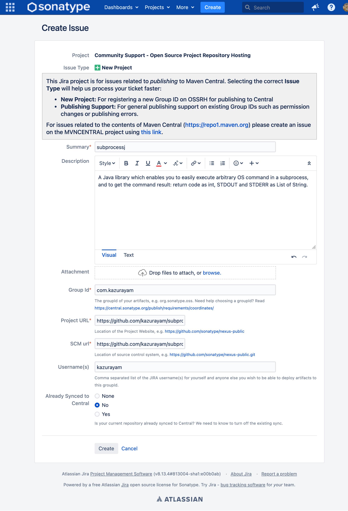
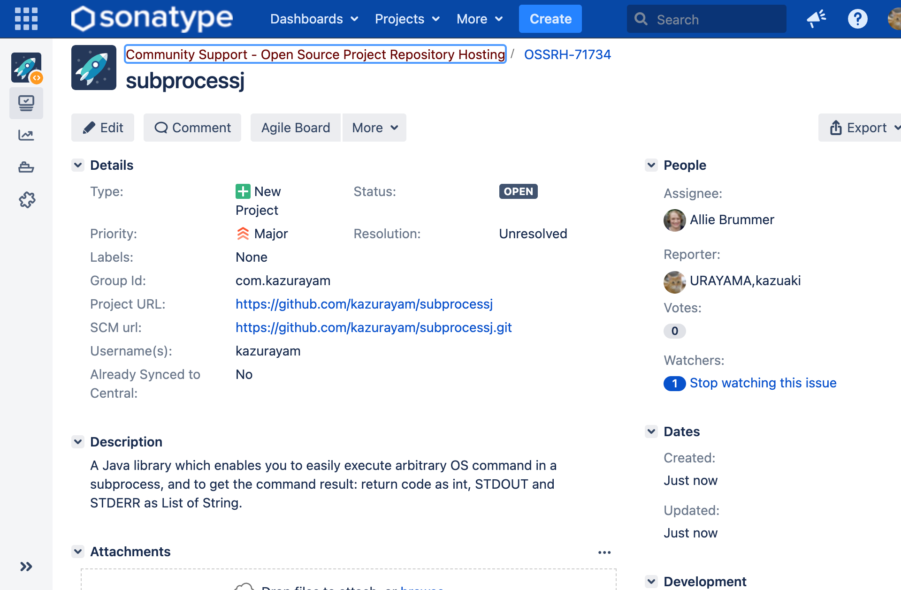

How I published this project at Maven Central Repository
=====

- @author kazurayam
- @date 31 JULY 2021

I read the following article and did as it tells.


## What I did...

### Create my credential for Sonatype JIRA

At first, I need to be able to login to [Sonatype JIRA](https://issues.sonatype.org/secure/Dashboard.jspa).

I Singed up there to create a credential for me.

I pushed the "Create" button to open a new issue for me to 





### My domain

I already have created my own public domain name: `com.kazurayam`. I use AWS Route53.

### Developed the project

Of course, I developed this project.
- I wrote enough unit tests.
- I wrote Gradle build.gradle to build the project's jar.
- I wrote the javadoc.
- I added LICENSE file, which states the Apache License 2.0.


### CI/CD


### jar of javadoc, source codes

In the build.gradle, I wrote
```
java {
    withSourcesJar()
    withJavadocJar()
}
```
then execute `$ gradle build`, then I got 2 jar files in the `build/lib` directory.

### create pom.xml

In the `build.gradle`, I added `maven-publish` plugin.

```
plugins {
    id 'java'
    id 'maven-publish'
}
```

The plugin adds the convention method named `pom`.

I write a task `createPom` in the build.gradle.


## Create an Issue in Sonatype JIRA for request publication.


[The Central Repository Documentation; Deploying to OSSRH with Gradle](https://central.sonatype.org/publish/publish-gradle/)


## sign with GnuPG

https://github.com/kazurayam/gpg_for_signing_subprocessj_artifacts

```
$ gradle sign
```

I got

```
$ cd build/libs
:~/github/subprocessj/build/libs (master *+)
$ tree .
.
|-- subprocessj-0.1.0-SNAPSHOT-javadoc.jar
|-- subprocessj-0.1.0-SNAPSHOT-javadoc.jar.asc
|-- subprocessj-0.1.0-SNAPSHOT-sources.jar
|-- subprocessj-0.1.0-SNAPSHOT-sources.jar.asc
|-- subprocessj-0.1.0-SNAPSHOT.jar
`-- subprocessj-0.1.0-SNAPSHOT.jar.asc

0 directories, 6 files
```

in the `build/libs` directory, I could find the *.jar files and the jar.asc files which is the "signages" of the jars.


### publishing the artfacts to the MavenLocal directory


```
$ cd subprocessj
:~/github/subprocessj (master *+)

$ gradle clean build sign publishToMavenLocal
...
BUILD SUCCESSFUL in 1s
6 actionable tasks: 6 executed
:~/github/subprocessj (master *+)

$ tree ~/.m2/repository/com/kazurayam
/Users/kazuakiurayama/.m2/repository/com/kazurayam
`-- subprocessj
    |-- 0.1.0-SNAPSHOT
    |   |-- maven-metadata-local.xml
    |   |-- subprocessj-0.1.0-SNAPSHOT.jar
    |   |-- subprocessj-0.1.0-SNAPSHOT.module
    |   `-- subprocessj-0.1.0-SNAPSHOT.pom
    `-- maven-metadata-local.xml

2 directories, 5 files


```


## How to build the jar + pom.xml and sign them

```
$ gradle clean signArchives signMavenJavaPublication
```

The `signArichives` task will create `build/libs/subprocessj-0.1.0-SNAPSHOT.jar.asc` file, which is the "digital signature" for the `build/libs/subprocessj-0.1.0-SNAPSHOT.jar` file.

The `signMavenJavaPublication` task will create `build/publications/mavenJava/pom-default.xml.asc` file, which is the "digital signature" for the `build/publications/mavenJava/pom-default.xml` file.


## I do not like "pom-default.xml", like "pom.xml". How can I change the name?


## "gradle publishToMavenLocal" does not copy the `pom-default.xml` file and the `jar.asc` files. How can it make it?


