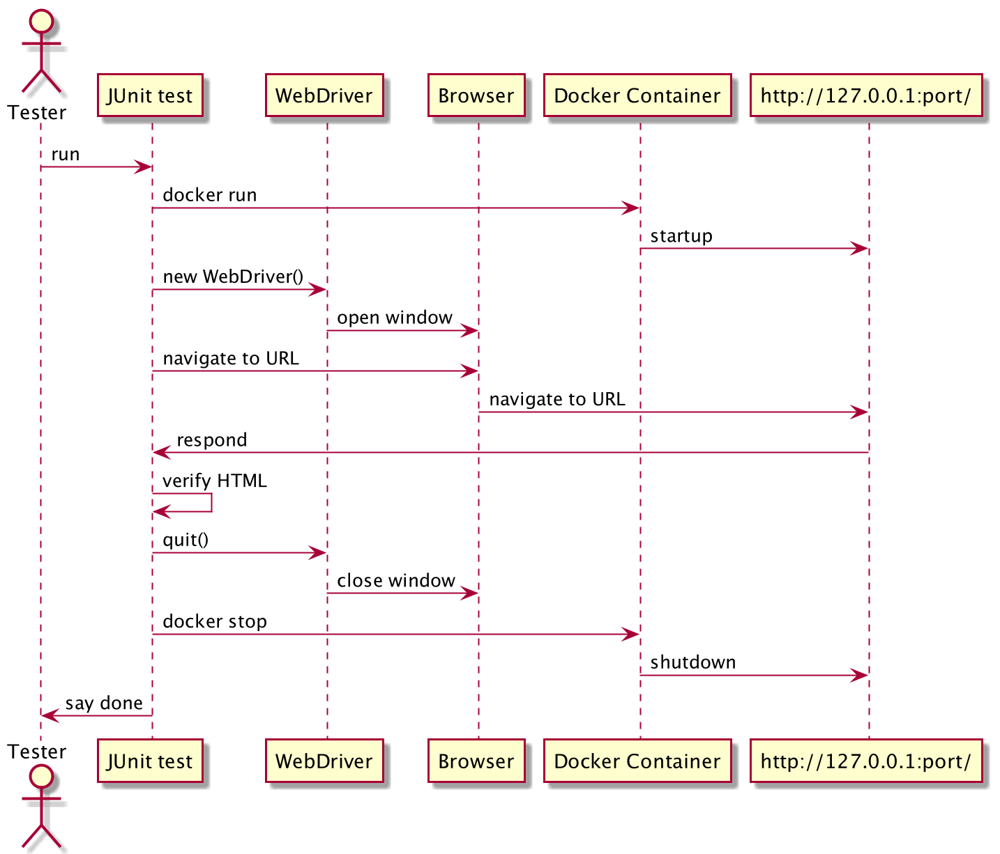

<!-- START doctoc -->
<!-- END doctoc -->

# subprocessj

## What is this?

1.  You can execute arbitrary OS command from your Java application
    using `com.kazurayam.subprocessj.Subprocess`.
    This class utilizes `java.lang.ProcessBuilder`.
    A new OS process will be started and run background.

2.  You can find the process id of the process which is listening to a specific IP port of the localhost
    using `com.kazurayam.subprocessj.ProcessFinder`.
    It can find the pid of current JVM process as well.

3.  You can stop a server process by pid or by the IP port
    using `com.kazurayam.subprocessj.ProcessTerminator`.

4.  You can find the absolute file path of commands
    using `com.kazurayam.subprocesj.CommandFinder`.

5.  You can find the type of OS on which your java application is
    currently working using `com.kazurayam.subprocessj.OSType`.

## Motivation

There are many articles that tell how to use [`java.lang.ProcessBuilder`](https://docs.oracle.com/javase/8/docs/api/java/lang/ProcessBuilder.html). For example, I learned ["Baeldung article: Run Shell Command in Java"](https://www.baeldung.com/run-shell-command-in-java). The ProcessBuilder class is a state of the art with rich set of functionalities. But it is not easy for me to write a program that utilized ProcessBuilder. It involves multi-threading to consume the output streams (STDOUT and STDERR) from subprocess. I do not want to repeat writing it.

So I have made a simple wrapper of ProcessBuilder which exposes a limited subset of its functionalities.

I named this as `subprocessj` as I meant it to be a homage to the [Subprocess](https://docs.python.org/3/library/subprocess.html) module of Python.

I wanted to use `Subprocess` to start and stop an HTTP server inside
a JUnit test for my Java application.
I wanted to start Python-based HTTP server using the `docker run` command.
Then I need to be able to kill the background process.
I wanted this procedure fully automated.
In order to achieve this, I developed `ProcessTerminator` and some helpers.

## API

Javadoc is [here](https://kazurayam.github.io/subprocessj/api/index.html).

## Example of using Subprocess classes

### Starting a process

You just call `com.kazurayam.subprocessj.Subprocess.run(List<String> command)`. The `run()` will wait for the sub-process to finish, and returns a `com.kazurayam.subprocessj.CompletedProcess` object which contains the return code, STDOUT and STDERR emitted by the sub-process.

    package com.kazurayam.subprocessj;

    import org.junit.jupiter.api.Disabled;
    import org.junit.jupiter.api.Test;

    import java.io.File;
    import java.nio.file.Files;
    import java.nio.file.Path;
    import java.nio.file.Paths;
    import java.util.Arrays;
    import java.util.stream.Collectors;
    import static org.junit.jupiter.api.Assertions.*;

    class SubprocessTest {

        @Test
        void test_list() throws Exception {
            Subprocess.CompletedProcess cp;
            if (OSType.isMac() || OSType.isUnix()) {
                cp = new Subprocess().cwd(new File("."))
                        .run(Arrays.asList("sh", "-c", "ls")
                        );
            } else {
                cp = new Subprocess().cwd(new File("."))
                        .run(Arrays.asList("cmd.exe", "/C", "dir")
                        );
            }
            assertEquals(0, cp.returncode());
            assertTrue(cp.stdout().size() > 0);
            cp.stdout().forEach(System.out::println);
            cp.stderr().forEach(System.err::println);
            assertTrue(cp.stdout().toString().contains("src"));
        }

        @Test
        void test_date() throws Exception {
            Subprocess.CompletedProcess cp;
            if (OSType.isMac() || OSType.isUnix()) {
                cp = new Subprocess().run(Arrays.asList("/bin/date"));
            } else {
                // I could not find out how to execute "date" command on Windows.
                cp = new Subprocess().run(Arrays.asList("java", "-version"));
            }
            assertEquals(0, cp.returncode());
            cp.stdout().forEach(System.out::println);
            cp.stderr().forEach(System.err::println);
            assertTrue(cp.stdout().size() > 0 || cp.stderr().size() > 0);
        }

        /**
         * this test method will throw IOException when executed on a CI/CD environment where
         * "git" is not installed. So I disabled this.
         */
        @Disabled
        @Test
        void test_git() throws Exception {
            Subprocess.CompletedProcess cp =
                        new Subprocess()
                                .cwd(new File(System.getProperty("user.home")))
                                .run(Arrays.asList("/usr/local/bin/git", "status"));
            assertEquals(128, cp.returncode());
            //System.out.println(String.format("stdout: %s", cp.getStdout()));
            //System.out.println(String.format("stderr: %s", cp.getStderr()));
            assertTrue(cp.stderr().size() > 0);
            assertEquals(1,
                    cp.stderr().stream()
                            .filter(line -> line.contains("fatal: not a git repository"))
                            .collect(Collectors.toList())
                            .size()
            );
        }

    }

This will emit the following output in the console:

    0
    total 4712
    drwxr-xr-x+  90 kazurayam       staff     2880  7 31 21:01 .
    drwxr-xr-x    6 root            admin      192  1  1  2020 ..
    ...

### Stopping a process

Using `java.lang.ProcessBuilder` class, you can create a `java.lang.Process` in which arbitrary application can run. Suppose you created a process in which HTTP Server runs. The process will stay running long until you explicitly stop it. But how can you stop that process?

Sometimes I encounter a new HTTP Server fails to start because the IP port is already in use. It tends to happen because I am not careful enough to stop the previous server process which is hanging on the IP port. In such situation, I have to do, on Mac, the following operations:

1.  execute a shell command `$ lsof -i:<port> -P`, to find out the id of the process which is still hanging on the IP port.

2.  execute a shell command `$ kill <processId>`, to stop the process.

3.  once the process is stopped, the IP port is released.

I wanted to automate this command line operation in my Java code. So I developed a Java class [`com.kazurayam.subprocessj.ProcessTerminator`](../src/main/java/com/kazurayam/subprocessj/ProcessTerminator.java).

See the following sample JUnit 5 test to see how to use the ProcessKiller.

    package com.kazurayam.subprocessj;

    import org.junit.jupiter.api.AfterAll;
    import org.junit.jupiter.api.BeforeAll;
    import org.junit.jupiter.api.Test;

    import java.io.IOException;
    import java.net.URL;
    import java.net.URLConnection;
    import java.util.Arrays;
    import java.util.List;
    import com.kazurayam.subprocessj.ProcessTerminator.ProcessTerminationResult;
    import static org.junit.jupiter.api.Assertions.assertTrue;

    /**
     * Start up a process in which HiThereServer runs on background,
     * will use java.lang.ProcessBuilder to create the subprocess.
     * Make an HTTP request and check the response.
     * Shutdown the process of HiThereServer.
     */
    public class HiThereServerAsProcessTest {

        @BeforeAll
        static public void beforeAll() throws IOException, InterruptedException {
            List<String> args = Arrays.asList(
                    "java",
                    "-cp", "build/classes/java/main",
                    "com.kazurayam.subprocessj.HiThereServer"
            );
            ProcessBuilder pb = new ProcessBuilder(args);
            Process process = pb.start();
            Thread.sleep(2000);  // wait for the process to boot successfully
        }

        @Test
        public void test_request_response() throws IOException {
            URL url = new URL("http://127.0.0.1:8500/");
            URLConnection conn = url.openConnection();
            String content = TestUtils.readInputStream(conn.getInputStream());
            assertTrue(content.contains("Hi there!"));
        }

        @AfterAll
        static public void afterAll() throws IOException, InterruptedException {
            ProcessTerminationResult tr = ProcessTerminator.killProcessOnPort(8500);
            assert tr.returncode() == 0;
        }

    }

@BeforeAll-annotated method starts the [HiThereServer](../src/main/java/com/kazurayam/subprocessj/HiThereServer.java) using `ProcessBuilder`. The process will start and stay running background. The HiThereServer is a simple HTTP server, listens to the IP port 8500.

@Test-annoted method makes an HTTP request to the HiThereServer.

@AfterAll-annotated method shuts down the HiThereServer using the `ProcessTerminator`. You specify the IP port 8500. The ProcessKiller will find the process ID of a process which is listening the port 8500, and kill the process.

### Finding the path of an OS command

    package com.kazurayam.subprocessj;

    import org.junit.jupiter.api.Disabled;
    import org.junit.jupiter.api.Test;
    import com.kazurayam.subprocessj.CommandLocator.CommandLocatingResult;

    import static org.junit.jupiter.api.Assertions.assertEquals;
    import static org.junit.jupiter.api.Assertions.assertNotEquals;

    public class CommandLocatorTest {

        /**
         * The returned value depends on the runtime environment.
         *
         * On Mac, this will return
         * <PRE>/usr/local/bin/git</PRE>
         *
         * On Windows, may be if the "Git for Windows" is installed.
         * If not, it will return rc=-1.
         */
        @Test
        void test_find_git_is_found() {
            CommandLocator.CommandLocatingResult cfr = CommandLocator.find("git");
            printCFR("test_find_git_is_found", cfr);
            assertEquals(0, cfr.returncode());
        }

        /**
         * just an alias to find(String command)
         */
        @Test
        void test_which_git() {
            CommandLocatingResult cfr = CommandLocator.which("git");
            printCFR("test_which_git", cfr);
            assertEquals(0, cfr.returncode());
        }

        /**
         * one more alias to find(String command)
         */
        @Test
        void test_where_git() {
            CommandLocatingResult cfr = CommandLocator.where("git");
            printCFR("test_where_git", cfr);
            assertEquals(0, cfr.returncode());
        }

        /**
         * The "tiger" command is expected NOT to be there
         */
        @Test
        void test_find_tiger_not_exists() {
            CommandLocator.CommandLocatingResult cfr = CommandLocator.find("tiger");
            printCFR("test_find_tiger_not_exists", cfr);
            assertNotEquals(0, cfr.returncode());
        }

        /**
         * On Windows, the "date" command is implemented as a sub-command of cmd.exe.
         * So CommandFinder.find("date") will return non-zero, no Path found.
         *
         * NO.
         * If you have Git Bash installed, you will have "C:\\Program Files\\Git\\usr\\bin\\date.exe
         */
        @Disabled
        @Test
        void test_find_date_on_Windows() {
            if (OSType.isWindows()) {
                CommandLocator.CommandLocatingResult cfr = CommandLocator.where("date");
                printCFR("test_find_date_on_Windows", cfr);
                assertEquals(0, cfr.returncode());
            }
        }

        private void printCFR(String label, CommandLocatingResult cfr) {
            System.out.println("-------- " + label + " --------");
            System.out.println(cfr.toString());
        }
    }

### Finding process id

#### Finding the pid of the current JVM

    package com.kazurayam.subprocessj;

    import org.junit.jupiter.api.Test;

    import static org.junit.jupiter.api.Assertions.assertTrue;

    public class ProcessFinderTest_CurrentJvmPid {

        @Test
        void test_getCurrentJvmPid() {
            long jvmProcessId = ProcessFinder.findCurrentJvmPid();
            assertTrue(jvmProcessId > 0);
        }

    }

#### Finding the pid of a process which is listening to a specific IP port

    package com.kazurayam.subprocessj;

    import com.kazurayam.subprocessj.ProcessFinder.ProcessFindingResult;
    import org.junit.jupiter.api.AfterAll;
    import org.junit.jupiter.api.BeforeAll;
    import org.junit.jupiter.api.Test;

    import java.io.IOException;
    import java.util.regex.Matcher;
    import java.util.regex.Pattern;

    import static org.junit.jupiter.api.Assertions.*;

    public class ProcessFinderTest_base {

        private static HiThereServer server;
        private static final int PORT = 8090;

        @BeforeAll
        public static void beforeAll() throws IOException {
            server = new HiThereServer();
            server.setPort(PORT);
            server.startup();
        }

        @AfterAll
        public static void afterAll() {
            server.shutdown();
        }

        /**
         * For example, this will show `1916` as the pid.
         */
        @Test
        void test_findProcessIdByListeningPort_found() {
            ProcessFindingResult pfr = ProcessFinder.findPidByListeningPort(PORT);
            System.out.println(pfr.processId());
            printPFR("test_findProcessIdByListeningPort_found", pfr);
            assertEquals(0, pfr.returncode(), pfr.message());
            assertTrue(pfr.processId() > 0);
        }

        private void printPFR(String label, ProcessFindingResult pfr) {
            System.out.println("-------- " + label + " --------");
            System.out.println(pfr.toString());
        }
    }

### Identifying OS Type

    package com.kazurayam.subprocessj;

    import org.junit.jupiter.api.Test;

    import static org.junit.jupiter.api.Assertions.assertTrue;

    public class OSTypeTest {

        /**
         * Which OS am I working on now?
         */
        @Test
        void test_getOSType() {
            assertTrue(OSType.isMac() || OSType.isUnix() || OSType.isWindows());
        }
    }

## Automated UI Test using WebDriver backed by Docker Container

### Problem to solve

I am interested in automating Web UI testing in Java/Groovy using Selenium WebDriver. At the same time, I am interested in developing Web Server applications in Python. So I want to execute UI tests written in Java against my Web Application written in Python. Of course, I can do it by the following manual operations.

In a Terminal on Mac, I start a Docker container by

    $ cd ~/tmp
    $ docker run -d -p 80:8080 kazurayam/flaskr-kazurayam:1.1.0

I will open another Terminal, and execute UI tests by

    $ cd $projectDir
    $ gradle test
    ....

When the test has finished, I will go back to the 1st terminal window. I will identify the process id of the docker container:

    $ docker ps --filter publish=80 --filter status=running -q
    fd5ad3b76b13

Once I find the pid, I can stop the process gracefully by:

    $ docker stop fd5ad3b76b13

This procedure is not difficult. But it is cumbersome, easy to make mistakes. I often forget terminating the previous docker container, and try to start another one. Then I get an error saying "the IP port is already in use". Just frustrating.

So, I want to automate starting and stopping any Docker Container on the localhost by my test code in Java.

### Solution

I have developed a code in Java using JUnit 5, which does the following:

-   This test visits and tests a URL "http://127.0.0.1:3080/" using Selenium WebDriver.

-   The URL is served by a process on the localhost, in which a Docker Container runs using a docker image which kazurayam published.

-   The web app was originally developed in Python language by the Pallets project, is published at [flaskr tutorial](https://flask.palletsprojects.com/en/2.0.x/tutorial/)

-   This test automates running and stopping a Docker Container process using commandline commands: `docker run`, `docker ps` and `docker stop`.

-   The [`com.kazurayam.subprocessj.docker.ContainerRunner`](https://github.com/kazurayam/subprocessj/blob/master/src/main/java/com/kazurayam/subprocessj/docker/ContainerRunner.java) class wraps the "docker run" command.

-   The [`com.kazurayam.subprocessj.docker.ContainerFinder`](https://github.com/kazurayam/subprocessj/blob/master/src/main/java/com/kazurayam/subprocessj/docker/ContainerFinder.java) class wraps the "docker ps" command.

-   The [`com.kazurayam.subprocessj.docker.ContainerStopper`](https://github.com/kazurayam/subprocessj/blob/master/src/main/java/com/kazurayam/subprocessj/docker/ContainerStopper.java) class wraps the "docker stop" command.

-   These classes call [`java.lang.ProcessBuilder`](https://www.baeldung.com/java-lang-processbuilder-api) to execute the `docker` command from Java.

-   The [`com.kazurayam.subprocessj.Subprocess`](https://github.com/kazurayam/subprocessj/blob/master/src/main/java/com/kazurayam/subprocessj/Subprocess.java) class wraps the `ProcessBuilder` and provides a simple API for Java application with work with OS commands.

### Description

#### Sequence diagram

The following diagram shows the sequence.

#### Sample code

-   [example.DockerBackedWebDriverTest](https://github.com/kazurayam/subprocessj/blob/master/src/test/java/example/DockerBackedWebDriverTest.java)

<!-- -->

    link:https://github.com/kazurayam/subprocessj/blob/master/src/test/java/example/DockerBackedWebDriverTest.java[DeockerBackedWebDriverTest]

### How to reuse this

See [build.gradle](https://github.com/kazurayam/subprocessj/blob/master/build.gradle)

### Conclusion

I wanted to perform automated Web UI testings written in Java/Groovy against a web application written in Python. The [Subprocessj 0.3.0](https://mvnrepository.com/artifact/com.kazurayam/subprocessj) library made it possible for me. I am contented with it.

### References for Docker

-   [forum.docker.com, “docker run” cannot be killed with ctrl+c](https://forums.docke.com/t/docker-run-cannot-be-killed-with-ctrl-c/13108/)

-   [docker ps command](https://matsuand.github.io/docs.docker.jp.onthefly/engine/reference/commandline/ps/)

-   [docker run command](https://docs.docker.com/engine/reference/commandline/run/)

-   [docker stop command](https://matsuand.github.io/docs.docker.jp.onthefly/engine/reference/commandline/stop/)

-   [subprocessj project top](https://github.com/kazurayam/subprocessj)

## links

The artifact is available at the Maven Central repository:

-   <https://mvnrepository.com/artifact/com.kazurayam/subprocessj>

The project’s repository is here

-   [the repository](https://github.com/kazurayam/subprocessj/)
